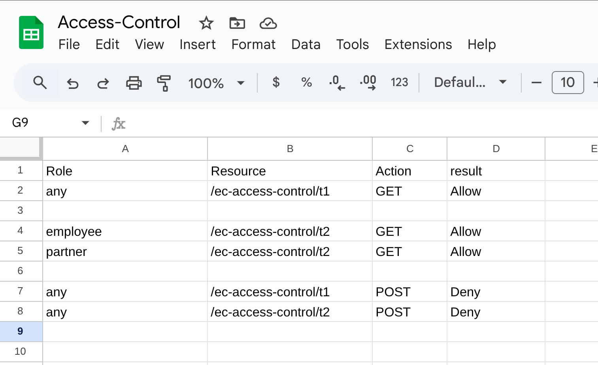

# Apigee External Access Control example

This repository shows one way to include externally-driven access
control decisions into Apigee API proxies.

It is possible to include _basic_ access control into Apigee, using the Apigee configuation flow
language.  But to include more dynamic access control into an Apigee API proxy, often you will
want to _externalize_ the access control decision, and allow Apigee to enforce the decision.

This repository shows one way to do that, using an implementation involving:
- An API Proxy configured in Apigee X (cloud)
- a Cloud Run service that makes access control decisions
- an ExternalCallout policy in the Apigee proxy to call to the Cloud Run service


## Background

_Basic_ access control in Apigee, using the Apigee configuation flow language, is easy.  For
example, it's really easy to configure an Apigee API proxy to allow access, only if the caller
presents a valid token (using the built-in Apigee policy
[`OAuthV2`](https://cloud.google.com/apigee/docs/api-platform/reference/policies/oauthv2-policy),
with Operation = `VerifyAccessToken`).  Or a valid, unexpired API Key (using the built-in Apigee
policy
[`VerifyAPIKey`](https://cloud.google.com/apigee/docs/api-platform/reference/policies/verify-api-key-policy)).

In the simple case, the OAuthV2/VerifyAccessToken policy would look like this:
```xml
<OAuthV2 name="OAuthV2-Verify-Access-Token">
  <Operation>VerifyAccessToken</Operation>
</OAuthV2>
```

And the VerifyAPIKey policy would look like this:
```xml
<VerifyAPIKey name="APIKeyVerifier">
  <APIKey ref="request.queryparam.apikey" />
</VerifyAPIKey>
```

In the former case, the one relying on the OAuthV2 access token, of course, the calling app must
have previously obtained the access token, via some grant flow. That is just the standard
OAuthV2 model, nothing new there.

But as you can see, whether using a key or a token, the control is binary. Either the
caller has the valid key or token, or it does not.  If you are managing more than a
handful of APIs, you want more control and flexibility than a "yes/no" check can provide.

### The use of API Products for Access Control

To extend beyond the "yes/no" decision, Apigee has the API product concept.
API publishers can configure specific client credentials (client IDs or API keys)
to be authorized for specific API Products.  The Products are really just collections of
Verb + Path pairs which will be permitted of authorized for that particular credential.
Then, at runtime, Apigee will verify that the presented application client credential is
authorized for an API Product that includes the particular verb + path pair that the
current API request is using.

For a 15-minute screencast review of the API Product concept and the implicit verb+path
authorization checks, [see here](https://youtu.be/HGkW3gtk7OM). But the basics are:

- At configuration time:
  - API publishers define API Products. Each one includes 1 or more verb + path pairs.
  - Client developers obtain credentials (client IDs) for their apps. Each credential is authorized for one or more API Products.
  - Client developers embed those credentials into the apps they build.

- At runtime:
  - client app sends in GET /foo (verb = GET, path = /foo).
  - When you call VerifyAPIKey or VerifyAccessToken, Apigee checks the key or token.
  - if valid, Apigee _implicitly_ checks that the verb + path pair is authorized via at least one of the API Products associated to the credential.

And beyond the basics, you can also configure Apigee to check a scope on an Access Token.

There is a handy
[working sample](https://github.com/GoogleCloudPlatform/apigee-samples/tree/main/apiproduct-operations)
that walks you through this, actually working in Apigee. Check it out!

### What about more flexible controls?

This is all very powerful, and allows API Platform teams to control which _apps can call
which APIs_.  One thing that is missing here is "role based access control", a/k/a RBAC,
which would allow an access control decision based on the _identity of the human_
operating the application. Also missing is ABAC, what [OWASP calls "Attribute Based
Access
Control"](https://cheatsheetseries.owasp.org/cheatsheets/Authorization_Cheat_Sheet.html#prefer-attribute-and-relationship-based-access-control-over-rbac),
which allows control based not just on the role or identity of the caller, but also
based on additional data, such as: Job role, time of day, project name, MAC address,
record creation date, prior activity pattern, and others. Apigee does not have a good
mechanism, by itself, for performing either user-by-user RBAC or the more general ABAC.

To accomplish user-based RBAC, or the more general ABAC, the typical pattern is to _externalize_
the access control decision and use Apigee to _enforce_ the decision.

The way it works for handling an inbound API call:

- The Apigee runtime collects or determines all of the information it needs to inform an
  access control decision. This might be information about the requesting user, a
  billing account status, patterns of recent activity, and so on. Normally the user
  information is obtained from something like an ID Token that is signed by an
  independent Identity Provider.

- Apigee sends an access control request to an external Access Control system. This
  request must include all the metadata that the external system will need to make a
  decision. The identity of the caller, the resource being requested, the specific
  action being requested, the source IP address, and so on. Whatever is required.

- The external system makes the decision (Allow or Deny), and sends it back to Apigee.

- The Apigee API proxy then enforces that decision.

The example contained in this repository shows how you can implement this pattern using
a custom Cloud Run service to externalize the access control decision.

## Disclaimer

This example is not an official Google product, nor is it part of an
official Google product. It's just an example.

## Implementation Details

The example here shows the basic idea.
Here's how it works.

 1. An app sends an API request into an Apigee API proxy. Within that request, rather than
    sending in an ID Token, the app sends an email address.
 2. The Apigee API proxy calls to an external service, passing it {subject, resource, action}. This service happens to be implemented in C#, but that's just a detail.
 3. The access control service calls the Google Sheets REST API to retrieve rules and roles.
 4. The access control service applies the access rules and returns a "ALLOW" or "DENY" to the proxy.
 5. The proxy enforces that decision.

The rules look like this:


And the logic that evaluates whether a request should be authorized according to those rules
looks like this:

```csharp
  private async Task<Boolean> EvaluateAccess(string subject, string resource, string action)
  {
      GsheetData rules = await _rds.GetAccessControlRules();
      GsheetData roles = await _rds.GetRoles();
      String role = ResolveRole(roles, subject);

      if (rules?.Values != null)
      {
          // First pass: check for specific role match
          if (role != null)
          {
              foreach (var ruleEntry in rules.Values)
              {
                  bool? allowed = CheckRule(ruleEntry, role, resource, action );
                  if (allowed.HasValue)
                      return allowed.Value;
              }
          }

          // Second pass: fallback to "any" role match
          foreach (var ruleEntry in rules.Values)
          {
              bool? allowed = CheckRule( ruleEntry, "any", resource, action );
              if (allowed.HasValue)
                  return allowed.Value;
          }
      }
      return false;
  }
```

Some implementation notes:

1. In step 1, the app just sends in an email address, which obviously can be anything.
   This is obviously an unverified claim, and receipents like Apigee should not depend
   on such claims. Trustworthy information about the user is usually rovided via a
   signed ID Token. But that is fairly simple to do, and I didn't want to clutter this
   example with the inclusion of an identity provider, and verifying a token.  That's an
   exercise left for the reader.  Remember, this is only an example, and the goal here
   is to show the access control, not the authentication part.

2. The access control service is a GRPC service. That means it will be relatively fast and efficient to call
   into, from your Apigee API Proxy, and it should be acceptable to incur that check for
   every API request. If the relatively low latency is still not acceptable, you can
   move the rules evaluation logic into the Apigee proxy itself.

### Why not OPA for this?

_Gooood Question!!_ [Open Policy Agent](https://www.openpolicyagent.org/) is a good
solution for storing, managing, and evaluating access rules, for arbitrary systems or
resources.  It's open source, well maintanied, and available as a deployable container
image. You can deploy [the container
image](https://hub.docker.com/r/openpolicyagent/opa) right to something like Cloud Run;
no need to build the code.

All sounds good, right?  The _one drawback_ that I've seen is that OPA depends on
[REGO](https://www.openpolicyagent.org/docs/policy-language) to express policies. This is
a domain-specific language; I have not seen it used in any place _other_ than OPA.
And it is somewhat novel. That can be an obstacle to some teams.

For this particular example, I decided to use a Google Sheet to store the access rules for these reasons:

- it's visual - it's easy to see what specific rules are in place, and easy to demonstrate;
- it's easy to update and maintain the access rules.
- it's easy to _protect_ the access rules with User rights on the Sheets document.
- it's easy to get a log of who changed what - just look at the version history on the sheet.

All of that, you get "for free" with a Google Sheet.

The C# logic that retrieves and applies the rules is also fairly easy to understand. The
combination of all of those factors means using Sheets and C# makes for a solution that
is more broadly _accessible_ than one based on the combination of OPA and REGO.

BUT, the architectural model of the solution using OPA would be _exactly the same_ as what I've
got here with a custom C# service and a Google Sheet.


## Screencast

TO BE ADDED


## Deploying it for your own purposes

To follow the instructions to deploy this in your own, you will need the following pre-requisites:

- Apigee X or hybrid
- a Google Cloud project with Cloud Run and Cloud Build enabled
- a Google Workspace environment that allows you to create and share spreadsheets
- .NET 8.0
- various tools: bash, [curl](https://curl.se/), [gcloud CLI](https://cloud.google.com/sdk/docs/install), [apigeecli](https://github.com/apigee/apigeecli), [jq](https://jqlang.org/)

You can get all of these things in the [Google Cloud Shell](https://cloud.google.com/shell/docs/launching-cloud-shell).


### Steps to follow:

1. Modify the env.sh file to suit your environment. Then source it to set those
   variables for use in subsequent commands:

   ```sh
   source ./env.sh
   ```

1. Enable the services needed:
   ```sh
   ./1-enable-services.sh
   ```

2. Signin with gcloud to allow the script to create a spreadsheet:
   ```sh
   ./2-auth-login.sh
   ```

3. Create the sheet that holds Rules + Roles
   ```sh
   ./3-create-sheet.sh
   ```

   When the script finishes, define the shell variable for the Sheet ID. Find that from the output
   of the "create sheet" step.
   ```sh
   export SHEET_ID=VALUE-FROM-PRIOR-STEP
   ```

4. Create the service account for the Access Control service.
   ```sh
   ./4-create-service-account.sh
   ```

5. Manually share the sheet created previously with the SA email address.


6. Deploy the Cloud Run Service that will read and apply the Rules in the sheet.

   ```sh
   ./5-deploy-cloud-run-service.sh
   ```

   This takes a few minutes. It sends the source code up to Cloud Build,
   builds the service, then deploys it from the image.


5. Install apigeecli

   ```sh
   ./6-install-apigeecli.sh
   ```

5. Create the target server in Apigee, pointing to the Cloud Run service.

   Apigee connects to the access control server via GRPC, for optimal performance.
   Connecting to a server using GRPC requires a target server.
   This step creates the necessary targetserver.

   ```sh
   ./7-create-apigee-target-server.sh
   ```

5. Import and deploy the Apigee API Proxy

   ```sh
   ./8-import-and-deploy-apigee-proxy.sh
   ```

   After this succeeds, the script will print out some suggested curl commands. You
   should be able to try them out to see the access control working.

   If you like you can add or modify data into the sheet, to see how it affects the
   access control decisions. If you make changes to the sheet, be aware: the Roles are
   cached for 3 minutes, and the Rules for 2 minutes, in the Access Control Service.

   You can also check the log output of the Access Control service in Cloud Run,
   to see what it is reading and doing.  To get more verbose logging, modify the 
   5-deploy-cloud-run-service.sh script to use Debug logging, and re-run the script.


### Clean Up

1. Remove the Apigee assets.

   This includes the target server and the API proxy.

   ```sh
   ./99-clean-apigee-entities.sh
   ```

2. Remove the Cloud Run assets.

   This includes the service account.

   ```sh
   ./99-clean-cloud-run-authorization-service.sh
   ```

3. Manually delete the Google sheet.


## Support

This callout and example proxy is open-source software, and is not a supported part of
Apigee.  If you have questions or need assistance with it, you can try inquiring on [the
Google Cloud Community forum dedicated to Apigee](https://goo.gle/apigee-community)
There is no service-level guarantee for responses to inquiries posted to that site.

## License

This material is [Copyright © 2025 Google LLC](./NOTICE).
and is licensed under the [Apache 2.0 License](LICENSE). This includes the Java
code as well as the API Proxy configuration.

## Bugs

* The Cloud Run service is deployed to allow "unauthenticated access".  If you use
  something like this in a real system, you will want to deploy the Cloud Run service to
  allow run.invoke from the service account your Access Control Service runs as.

* The C# service does not check for malformed rules or roles.

* The proxy trusts an email address just sent in a request header. A real system will
  rely only on an ID token from a trusted identity provider.
